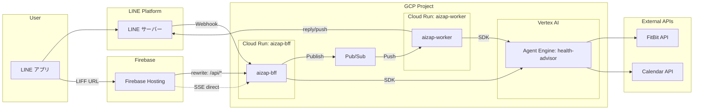

# aizap

AI Nutritionist & Coaching - 健康アドバイザーエージェント

## 概要

aizap は Google ADK (Agent Development Kit) を使用した AI 健康アドバイザーです。
ユーザーの健康目標設定、食事前アドバイス、食事記録をサポートします。

## MVP 機能

- **健康目標設定**: 減量、筋肉増量、睡眠改善などの目標を設定・管理
- **食事前アドバイス**: 時間帯や過去の食事を考慮したメニュー提案
- **食事記録**: テキストや画像から食事内容とカロリーを記録

## ディレクトリ構成

```
aizap/
├── .github/
│   └── workflows/
│       ├── infra-plan.yml          # PR 時に terraform plan（インフラ）
│       ├── infra-release.yml       # main push 時に terraform apply（インフラ）
│       ├── app-deploy.yml          # アプリのビルド・デプロイ
│       └── agent-deploy.yml        # Agent Engine へエージェントをデプロイ
├── app/
│   ├── bff/                        # aizap-bff (LINE Webhook, LIFF API)
│   │   ├── Dockerfile
│   │   ├── main.py
│   │   └── requirements.txt
│   ├── worker/                     # aizap-worker (Pub/Sub -> Agent Engine -> LINE)
│   │   ├── Dockerfile
│   │   ├── main.py
│   │   └── requirements.txt
│   └── adk/                        # ADK エージェント（Agent Engine へデプロイ）
│       ├── requirements.txt
│       └── agents/
│           └── health_advisor/     # 健康アドバイザーエージェント
├── infra/
│   ├── dev/                        # 開発環境 (aizap-dev)
│   │   ├── backend.tf
│   │   ├── main.tf
│   │   └── variables.tf
│   ├── prod/                       # 本番環境 (aizap-prod)
│   │   ├── backend.tf
│   │   ├── main.tf
│   │   └── variables.tf
│   └── modules/                    # 共通 Terraform モジュール
│       ├── cloud_run/
│       ├── pubsub/
│       ├── service_account/
│       └── workload_identity/
└── README.md
```

## エージェント構成

```
root_agent (gemini-2.5-flash)
├── goal_setting_agent      # 健康目標の設定・確認
├── pre_meal_advisor_agent  # 食事前のアドバイス・レシピ提案
└── meal_record_agent       # 食事の記録・カロリー推定
```

### 委譲の仕組み

1. ユーザーからのメッセージが `root_agent` に到達
2. `root_agent` がメッセージ内容を解析
3. 各サブエージェントの `description` を参照し、適切なエージェントに委譲
4. サブエージェントがツールを使用して処理を実行
5. 結果をユーザーに返却

## インフラ構成

### アーキテクチャ



### コンポーネント

| コンポーネント | 説明 |
|---------------|------|
| **aizap-bff** | LINE Webhook 受信、LIFF API エンドポイント |
| **aizap-worker** | Pub/Sub Push 受信、Agent Engine 呼び出し、LINE 返信 |
| **Agent Engine (health-advisor)** | ADK エージェント（Vertex AI マネージドサービス） |
| **Cloud Pub/Sub** | Webhook 非同期処理（LINE 2秒タイムアウト対策） |
| **Artifact Registry** | コンテナイメージ保存 |
| **Workload Identity** | GitHub Actions → GCP 認証 |

### 環境

| 環境 | GCP プロジェクト | 用途 |
|-----|-----------------|------|
| dev | [aizap-dev](https://console.cloud.google.com/welcome?project=aizap-dev) | 開発・テスト |
| prod | [aizap-prod](https://console.cloud.google.com/welcome?project=aizap-prod) | 本番 |

## CI/CD

GitHub Actions を使用して CI/CD を実現しています。

### ワークフロー

| ワークフロー | トリガー | 動作 |
|-------------|---------|------|
| `infra-plan.yml` | PR（infra/** 変更時） | `terraform plan` を実行 |
| `infra-release.yml` | main push / `infra-v*` タグ | `terraform apply` を実行（インフラのみ） |
| `app-deploy.yml` | main push / `app-v*` タグ | BFF/Worker をビルド・デプロイ |
| `agent-deploy.yml` | workflow_dispatch | Agent Engine へエージェントをデプロイ |

### アプリのデプロイ（app-deploy.yml）

1. **パス検知**: 変更があったサービス（bff, worker）のみビルド対象
2. **Build**: Cloud Build でイメージをビルドし Artifact Registry へ push
3. **Deploy**: Terraform apply で Cloud Run にデプロイ

| トリガー | 環境 | 対象サービス |
|---------|------|-------------|
| main push（app/** 変更） | dev | 変更があったサービスのみ |
| `app-v*` タグ | prod | 全サービス |
| workflow_dispatch | 選択可能 | 選択可能 |

### Agent Engine デプロイ（agent-deploy.yml）

ADK エージェントは Vertex AI Agent Engine にデプロイします。
`app/adk/agents/` 配下の全エージェントを自動検出し、並列でデプロイします。

```bash
# GitHub Actions から手動実行
# Actions → Deploy Agent Engine → Run workflow
```

| 入力 | 説明 |
|------|------|
| `environment` | dev / prod |

### 環境の切り替え

- **main push**: dev 環境にデプロイ
- **`infra-v*` / `app-v*` タグ**: prod 環境にデプロイ
- **workflow_dispatch**: 手動で環境を選択可能

### GitHub Environment Secrets

各環境（development / production）に以下の secrets を設定：

| Secret | 説明 |
|--------|------|
| `PROJECT_ID` | GCP プロジェクト ID |
| `WORKLOAD_IDENTITY_PROVIDER` | Workload Identity Provider |
| `SERVICE_ACCOUNT` | GitHub Actions 用サービスアカウント |

## セットアップ

### アプリケーション（ローカル開発）

```bash
# リポジトリをクローン
git clone https://github.com/heyhey1028/aizap.git
cd aizap/app/agents

# 仮想環境を作成
python -m venv .venv
source .venv/bin/activate

# 依存関係をインストール
pip install google-adk

# GCP認証 (ローカル実行用)
gcloud auth application-default login

# 環境変数を設定
export GOOGLE_GENAI_USE_VERTEXAI=1
export GOOGLE_CLOUD_PROJECT=aizap-dev
export GOOGLE_CLOUD_LOCATION=asia-northeast1
```

### ADK Web UI で実行

```bash
adk web --port 8000
```

### ADK ローカル開発

ADK CLI を使用してローカルでエージェントをテストできます。

#### セットアップ

```bash
cd app/adk

# 仮想環境を作成・有効化
python -m venv .venv
source .venv/bin/activate

# ADK をインストール
pip install google-adk
```

#### 開発コマンド

| コマンド | 説明 | セッション |
|---------|------|-----------|
| `adk web` | ブラウザベース開発 UI | InMemorySessionService（自動） |
| `adk run` | ターミナル対話型テスト | InMemorySessionService（自動） |
| `adk api_server` | ローカル REST API サーバー | InMemorySessionService（自動） |

#### 実行例

```bash
# ブラウザで開発 UI を起動
adk web agents/health_advisor
# => http://localhost:8000 でアクセス

# ターミナルで対話
adk run agents/health_advisor

# REST API サーバーを起動
adk api_server agents/health_advisor
```

### Agent Engine へのデプロイ

本番環境では Vertex AI Agent Engine にデプロイします。Agent Engine は自動的に VertexAiSessionService を使用してセッションを永続化します。

> **Note**: Agent Engine は Python 3.10〜3.12 のみサポートしています。

#### 手動デプロイ（ADK CLI）

```bash
cd app/adk/agents

# ADK CLI でデプロイ
# staging_bucket は Terraform で作成済み: gs://${PROJECT_ID}-staging
adk deploy agent_engine \
  --project=aizap-dev \
  --region=asia-northeast1 \
  --staging_bucket=gs://aizap-dev-staging \
  --display_name="aizap-health-advisor" \
  health_advisor
```

#### GitHub Actions からデプロイ（推奨）

1. Actions → **Deploy Agent Engine** → **Run workflow**
2. environment を選択（dev / prod）
3. 実行（`app/adk/agents/` 配下の全エージェントが自動デプロイされます）

### インフラ（Terraform）

インフラの変更は基本的に **GitHub Actions** で実行します（PR で plan、main push で apply）。

ローカルで plan を確認したい場合は以下のコマンドを実行してください：

```bash
# GCP 認証
gcloud auth application-default login

cd infra/dev

# 初期化
terraform init

# プラン確認
terraform plan \
  -var=project_id=aizap-dev \
  -var=region=asia-northeast1 \
  -var=environment=dev \
  -var=image_bff=gcr.io/cloudrun/hello \
  -var=image_worker=gcr.io/cloudrun/hello
```

> **Note**: `image_*` には現在デプロイ中のイメージを指定してください。GitHub Actions では自動で現在のイメージを取得します。
