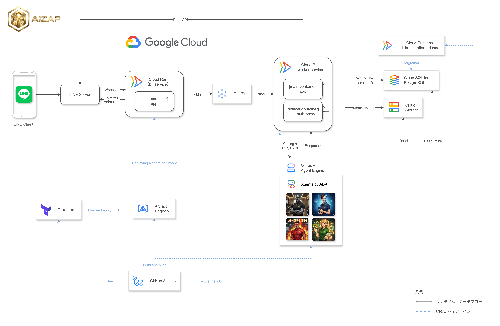

# aizap

AI Nutritionist & Coaching - 健康アドバイザーエージェント


## 概要

aizap は Google ADK (Agent Development Kit) を使用した AI 健康アドバイザーです。
ユーザーの健康目標設定、食事前アドバイス、食事記録をサポートします。

## アーキテクチャ



### コンポーネント

| コンポーネント        | 技術スタック                | 説明                                                                                          |
| --------------------- | --------------------------- | --------------------------------------------------------------------------------------------- |
| **bff-service**       | TypeScript / Hono           | LINE Webhook 受信 → Pub/Sub Publish、LIFF ホスト、Loading Animation 表示（DB 接続なし）       |
| **worker-service**    | TypeScript / Hono / Prisma  | Pub/Sub Push → Agent Engine REST API → LINE Push API、DB 接続、GCS Upload。sidecar に Cloud SQL Auth Proxy を使用 |
| **db-migration-prisma** | Cloud Run Job             | Prisma マイグレーション実行（デプロイ時に GitHub Actions から自動実行）                       |
| **Agent Engine**      | Python / ADK / SQLAlchemy   | ADK エージェント（`app/adk/agents/` 配下）、DB 接続、GCS Read/Write                          |
| **Cloud SQL**         | PostgreSQL                  | データベース（Worker と Agent Engine から接続）                                               |
| **Cloud Storage**     | -                           | LINE メディア保存（画像/動画/音声）、Worker が Upload、Agent Engine が Read/Write             |
| **Cloud Pub/Sub**     | -                           | Webhook 非同期処理（LINE 2 秒タイムアウト対策）                                               |
| **Artifact Registry** | -                           | コンテナイメージ保存                                                                          |
| **Workload Identity** | -                           | GitHub Actions → GCP 認証                                                                     |

### 責務分離の方針

- **BFF**: LINE の窓口として、2 秒以内に 200 を返すことに専念。CloudSQL には接続しない。
- **Worker**: Pub/Sub から受け取ったメッセージを処理。Agent Engine 呼び出し、LINE 返信、DB 操作を担当。
- **Agent Engine**: ビジネスロジック（エージェント処理）に専念。必要に応じて DB アクセス。

### エージェント構成

```
root_agent (gemini-3-flash-preview)
├── goal_setting_agent       # 健康目標の設定・確認
├── meal_record_agent        # 食事の記録・カロリー推定・レシピ提案
├── exercise_manager_agent   # 運動記録・習慣計画
└── db_sample_agent          # 開発用 DB テスト
```

**委譲の仕組み:**

1. ユーザーからのメッセージが `root_agent` に到達
2. `root_agent` がメッセージ内容を解析
3. 各サブエージェントの `description` を参照し、適切なエージェントに委譲
4. サブエージェントがツールを使用して処理を実行
5. 結果をユーザーに返却

**finish_task による制御の戻し（ルーティング例）:**

サブエージェントが処理を終えたら、`finish_task(summary="...")` を呼ぶと対話権がルートに戻る。

```
ユーザー「今日ベンチプレス10回×3セットやった」
  → root_agent が exercise_manager_agent に委譲
  → サブエージェントが運動記録を保存し、finish_task(summary="ベンチプレス 10回×3セット を記録") を実行
  → 制御が root_agent に戻り、ツール結果として summary が渡る
  → root_agent が「ベンチプレス記録したね、いいね！」などとユーザーに返答
```

### 環境

| 環境 | GCP プロジェクト                                                          | 用途         |
| ---- | ------------------------------------------------------------------------- | ------------ |
| dev  | [aizap-dev](https://console.cloud.google.com/welcome?project=aizap-dev)   | 開発・テスト |
| prod | [aizap-prod](https://console.cloud.google.com/welcome?project=aizap-prod) | 本番         |

## ディレクトリ構成

```text
aizap/
├── .github/
│   ├── actions/                    # 再利用可能な Composite Actions
│   └── workflows/                  # CI/CD ワークフロー
├── app/
│   ├── bff/                        # LINE Webhook, LIFF ホスト (TypeScript/Hono)
│   │   └── src/
│   │       ├── apis/               # Webhook, ヘルスチェック
│   │       ├── clients/            # Pub/Sub, LINE SDK クライアント
│   │       ├── middleware/         # 署名検証など
│   │       └── pages/              # LIFF ページ (Hono JSX)
│   ├── worker/                     # Pub/Sub → Agent Engine → LINE (TypeScript/Hono)
│   │   ├── prisma/                 # スキーマ・マイグレーション
│   │   └── src/
│   │       ├── apis/               # Webhook, ヘルスチェック
│   │       ├── clients/            # Agent Engine, LINE, GCS クライアント
│   │       └── utils/              # メディア処理など
│   └── adk/                        # ADK エージェント (Python)
│       └── agents/
│           └── health_advisor/
│               ├── sub_agents/     # サブエージェント
│               ├── tools/          # エージェントツール
│               └── db/             # SQLAlchemy リポジトリ・モデル
├── infra/
│   ├── dev/                        # 開発環境 Terraform
│   ├── prod/                       # 本番環境 Terraform
│   └── modules/                    # 共通モジュール
│       ├── cloud_run/              # Cloud Run サービス定義
│       ├── cloud_sql/              # Cloud SQL インスタンス
│       ├── pubsub/                 # Pub/Sub Topic / Subscription
│       ├── secret_manager/         # Secret Manager
│       ├── service_account/        # サービスアカウント
│       └── workload_identity/      # Workload Identity Federation
├── assets/                         # アーキテクチャ図などの画像
├── docs/                           # 詳細ドキュメント
└── README.md
```

## クイックスタート

### 1. リポジトリをクローン

```bash
git clone https://github.com/heyhey1028/aizap.git
cd aizap/app/adk
```

### 2. セットアップ

```bash
# uv をインストール
brew install uv
# または: curl -LsSf https://astral.sh/uv/install.sh | sh

# 仮想環境を作成
uv venv

# 依存関係をインストール
uv sync

# GCP 認証（サービスアカウントのなりすましでローカル（開発者経由）から Cloud SQL にアクセス可能）
gcloud auth application-default login \
  --impersonate-service-account=aizap-adk-sa@aizap-dev.iam.gserviceaccount.com

# 環境変数を設定
export GOOGLE_GENAI_USE_VERTEXAI=1
export GOOGLE_CLOUD_PROJECT=aizap-dev
export GOOGLE_CLOUD_LOCATION=asia-northeast1
export CLOUD_SQL_INSTANCE=aizap-dev:asia-northeast1:aizap-postgres-dev
export DB_NAME=aizap
```

### 3. ADK を起動

```bash
uv run adk web agents
```

ブラウザで http://localhost:8000 にアクセスし、ドロップダウンから `health_advisor` を選択

## ドキュメント

| ドキュメント | 内容 |
|-------------|------|
| [CI/CD](docs/cicd.md) | ワークフロー、Composite Actions、デプロイ |
| [開発ガイド](docs/development.md) | ローカル開発、ADK コマンド、デプロイ手順 |
