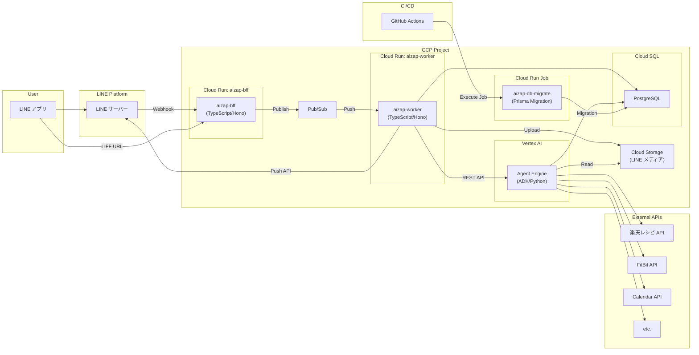

# aizap

AI Nutritionist & Coaching - 健康アドバイザーエージェント

## 概要

aizap は Google ADK (Agent Development Kit) を使用した AI 健康アドバイザーです。
ユーザーの健康目標設定、食事前アドバイス、食事記録をサポートします。

## アーキテクチャ



### コンポーネント

| コンポーネント        | 技術スタック        | 説明                                                                        |
| --------------------- | ------------------- | --------------------------------------------------------------------------- |
| **aizap-bff**         | TypeScript / Hono   | LINE Webhook 受信 → Pub/Sub Publish、LIFF ホスト（DB 接続なし）             |
| **aizap-worker**      | TypeScript / Hono   | Pub/Sub Push → Agent Engine REST API → LINE Push API、DB 接続、GCS Upload  |
| **aizap-db-migrate**  | Cloud Run Job       | Prisma マイグレーション実行（デプロイ時に GitHub Actions から自動実行）     |
| **Agent Engine**      | Python / ADK        | ADK エージェント（`app/adk/agents/` 配下）、DB 接続、GCS Read               |
| **Cloud SQL**         | PostgreSQL          | データベース（Worker と Agent Engine から接続）                             |
| **Cloud Storage**     | -                   | LINE メディア保存（画像/動画/音声）、Worker が Upload、Agent Engine が Read |
| **Cloud Pub/Sub**     | -                   | Webhook 非同期処理（LINE 2 秒タイムアウト対策）                             |
| **Artifact Registry** | -                   | コンテナイメージ保存                                                        |
| **Workload Identity** | -                   | GitHub Actions → GCP 認証                                                   |

### 責務分離の方針

- **BFF**: LINE の窓口として、2 秒以内に 200 を返すことに専念。CloudSQL には接続しない。
- **Worker**: Pub/Sub から受け取ったメッセージを処理。Agent Engine 呼び出し、LINE 返信、DB 操作を担当。
- **Agent Engine**: ビジネスロジック（エージェント処理）に専念。必要に応じて DB アクセス。

### エージェント構成

```
root_agent (gemini-2.5-flash)
├── goal_setting_agent      # 健康目標の設定・確認
├── pre_meal_advisor_agent  # 食事前のアドバイス・レシピ提案
└── meal_record_agent       # 食事の記録・カロリー推定
```

**委譲の仕組み:**

1. ユーザーからのメッセージが `root_agent` に到達
2. `root_agent` がメッセージ内容を解析
3. 各サブエージェントの `description` を参照し、適切なエージェントに委譲
4. サブエージェントがツールを使用して処理を実行
5. 結果をユーザーに返却

### 環境

| 環境 | GCP プロジェクト                                                          | 用途         |
| ---- | ------------------------------------------------------------------------- | ------------ |
| dev  | [aizap-dev](https://console.cloud.google.com/welcome?project=aizap-dev)   | 開発・テスト |
| prod | [aizap-prod](https://console.cloud.google.com/welcome?project=aizap-prod) | 本番         |

## MVP 機能

- **健康目標設定**: 減量、筋肉増量、睡眠改善などの目標を設定・管理
- **食事前アドバイス**: 時間帯や過去の食事を考慮したメニュー提案
- **食事記録**: テキストや画像から食事内容とカロリーを記録

## ディレクトリ構成

```
aizap/
├── .github/
│   ├── actions/                    # 再利用可能な Composite Actions
│   └── workflows/                  # CI/CD ワークフロー
├── app/
│   ├── bff/                        # LINE Webhook, LIFF API
│   ├── worker/                     # Pub/Sub -> Agent Engine -> LINE
│   └── adk/                        # ADK エージェント
│       └── agents/
│           └── health_advisor/
├── infra/
│   ├── dev/                        # 開発環境 Terraform
│   ├── prod/                       # 本番環境 Terraform
│   └── modules/                    # 共通モジュール
├── docs/                           # 詳細ドキュメント
└── README.md
```

## クイックスタート

### 1. リポジトリをクローン

```bash
git clone https://github.com/heyhey1028/aizap.git
cd aizap/app/adk
```

### 2. セットアップ

```bash
# 仮想環境を作成・有効化
python -m venv .venv
source .venv/bin/activate

# ADK をインストール
pip install google-adk

# GCP 認証
gcloud auth application-default login

# 環境変数を設定
export GOOGLE_GENAI_USE_VERTEXAI=1
export GOOGLE_CLOUD_PROJECT=aizap-dev
export GOOGLE_CLOUD_LOCATION=asia-northeast1
```

### 3. ADK を起動

```bash
adk web agents/health_advisor
```

ブラウザで http://localhost:8000 にアクセス

## ドキュメント

| ドキュメント | 内容 |
|-------------|------|
| [CI/CD](docs/cicd.md) | ワークフロー、Composite Actions、デプロイ |
| [開発ガイド](docs/development.md) | ローカル開発、ADK コマンド、デプロイ手順 |
