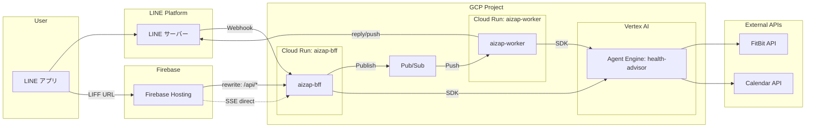

# アーキテクチャ

## 概要

aizap は LINE をインターフェースとした AI 健康アドバイザーです。
Google ADK (Agent Development Kit) を使用し、Vertex AI Agent Engine 上で動作します。

## システム構成



## コンポーネント

| コンポーネント | 説明 |
|---------------|------|
| **aizap-bff** | LINE Webhook 受信、LIFF API エンドポイント |
| **aizap-worker** | Pub/Sub Push 受信、Agent Engine 呼び出し、LINE 返信 |
| **Agent Engine (health-advisor)** | ADK エージェント（Vertex AI マネージドサービス） |
| **Cloud Pub/Sub** | Webhook 非同期処理（LINE 2秒タイムアウト対策） |
| **Artifact Registry** | コンテナイメージ保存 |
| **Workload Identity** | GitHub Actions → GCP 認証 |

## エージェント構成

```
root_agent (gemini-2.5-flash)
├── goal_setting_agent      # 健康目標の設定・確認
├── pre_meal_advisor_agent  # 食事前のアドバイス・レシピ提案
└── meal_record_agent       # 食事の記録・カロリー推定
```

### 委譲の仕組み

1. ユーザーからのメッセージが `root_agent` に到達
2. `root_agent` がメッセージ内容を解析
3. 各サブエージェントの `description` を参照し、適切なエージェントに委譲
4. サブエージェントがツールを使用して処理を実行
5. 結果をユーザーに返却

## 環境

| 環境 | GCP プロジェクト | 用途 |
|-----|-----------------|------|
| dev | [aizap-dev](https://console.cloud.google.com/welcome?project=aizap-dev) | 開発・テスト |
| prod | [aizap-prod](https://console.cloud.google.com/welcome?project=aizap-prod) | 本番 |
