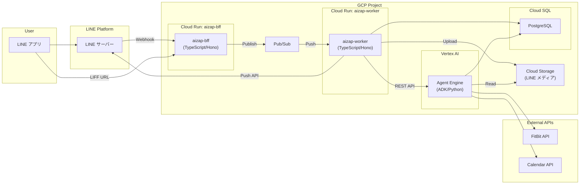

# アーキテクチャ

## 概要

aizap は LINE をインターフェースとした AI 健康アドバイザーです。
Google ADK (Agent Development Kit) を使用し、Vertex AI Agent Engine 上で動作します。

## システム構成



## コンポーネント

| コンポーネント        | 技術スタック        | 説明                                                                        |
| --------------------- | ------------------- | --------------------------------------------------------------------------- |
| **aizap-bff**         | TypeScript / Hono   | LINE Webhook 受信 → Pub/Sub Publish、LIFF ホスト（DB 接続なし）             |
| **aizap-worker**      | TypeScript / Hono   | Pub/Sub Push → Agent Engine REST API → LINE Push API、DB 接続、GCS Upload  |
| **Agent Engine**      | Python / ADK        | ADK エージェント（`app/adk/agents/` 配下）、DB 接続、GCS Read               |
| **Cloud SQL**         | PostgreSQL          | データベース（Worker と Agent Engine から接続）                             |
| **Cloud Storage**     | -                   | LINE メディア保存（画像/動画/音声）、Worker が Upload、Agent Engine が Read |
| **Cloud Pub/Sub**     | -                   | Webhook 非同期処理（LINE 2 秒タイムアウト対策）                             |
| **Artifact Registry** | -                   | コンテナイメージ保存                                                        |
| **Workload Identity** | -                   | GitHub Actions → GCP 認証                                                   |

### 責務分離の方針

- **BFF**: LINE の窓口として、2 秒以内に 200 を返すことに専念。CloudSQL には接続しない。
- **Worker**: Pub/Sub から受け取ったメッセージを処理。Agent Engine 呼び出し、LINE 返信、DB 操作を担当。
- **Agent Engine**: ビジネスロジック（エージェント処理）に専念。必要に応じて DB アクセス。

## エージェント構成

```
root_agent (gemini-2.5-flash)
├── goal_setting_agent      # 健康目標の設定・確認
├── pre_meal_advisor_agent  # 食事前のアドバイス・レシピ提案
└── meal_record_agent       # 食事の記録・カロリー推定
```

### 委譲の仕組み

1. ユーザーからのメッセージが `root_agent` に到達
2. `root_agent` がメッセージ内容を解析
3. 各サブエージェントの `description` を参照し、適切なエージェントに委譲
4. サブエージェントがツールを使用して処理を実行
5. 結果をユーザーに返却

## 環境

| 環境 | GCP プロジェクト                                                          | 用途         |
| ---- | ------------------------------------------------------------------------- | ------------ |
| dev  | [aizap-dev](https://console.cloud.google.com/welcome?project=aizap-dev)   | 開発・テスト |
| prod | [aizap-prod](https://console.cloud.google.com/welcome?project=aizap-prod) | 本番         |
