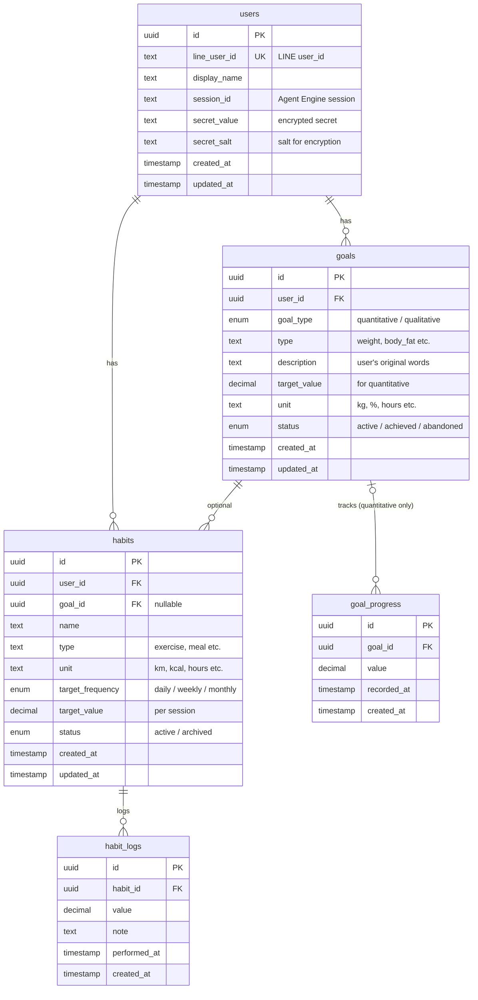

# データベース設計

## 概要

aizap では PostgreSQL を使用し、Prisma ORM でデータアクセスを行います。

| 項目 | 詳細 |
|------|------|
| DBMS | PostgreSQL 17 |
| ORM | Prisma 7.x |
| インフラ | Google Cloud SQL |

## ER図



## テーブル定義

### users

ユーザー情報と Agent Engine セッションを管理する。

| カラム | 型 | 制約 | 説明 |
|--------|-----|------|------|
| id | UUID | PK | ユーザーID |
| line_user_id | TEXT | UNIQUE, NOT NULL | LINE の user_id |
| display_name | TEXT | NOT NULL | 表示名 |
| session_id | TEXT | | Agent Engine セッションID |
| secret_value | TEXT | | 暗号化されたシークレット |
| secret_salt | TEXT | | 暗号化用ソルト |
| created_at | TIMESTAMP | NOT NULL | 作成日時 |
| updated_at | TIMESTAMP | NOT NULL | 更新日時 |

### goals

ユーザーの目標を管理する。定量的・定性的の両方に対応。

| カラム | 型 | 制約 | 説明 |
|--------|-----|------|------|
| id | UUID | PK | 目標ID |
| user_id | UUID | FK(users), NOT NULL | ユーザーID |
| goal_type | ENUM | NOT NULL | `quantitative` / `qualitative` |
| type | TEXT | | 目標の種類（推奨値あり、下記参照） |
| description | TEXT | NOT NULL | ユーザーの言葉による目標定義 |
| target_value | DECIMAL | | 目標値（定量目標の場合） |
| unit | TEXT | | 単位（kg, %, hours など） |
| status | ENUM | NOT NULL | `active` / `achieved` / `abandoned` |
| created_at | TIMESTAMP | NOT NULL | 作成日時 |
| updated_at | TIMESTAMP | NOT NULL | 更新日時 |

**type の推奨値（定量目標の場合）:**

| 値 | 説明 |
|-----|------|
| `weight` | 体重 |
| `body_fat` | 体脂肪率 |
| `sleep_hours` | 睡眠時間 |
| `steps` | 歩数 |
| `water_intake` | 水分摂取量 |

※ 上記に当てはまらない場合は、AIがユーザーの入力から適切な値を設定する。

**goal_type による使い分け:**

| goal_type | type | description | target_value | unit | goal_progress |
|-----------|------|-------------|--------------|------|---------------|
| quantitative | 必須 | 必須 | 必須 | 必須 | 使用する |
| qualitative | null | 必須 | null | null | 使用しない |

### goal_progress

目標に対する進捗（現在地）を記録する。

| カラム | 型 | 制約 | 説明 |
|--------|-----|------|------|
| id | UUID | PK | 進捗ID |
| goal_id | UUID | FK(goals), NOT NULL | 目標ID |
| value | DECIMAL | NOT NULL | 記録値 |
| recorded_at | TIMESTAMP | NOT NULL | 記録日時 |
| created_at | TIMESTAMP | NOT NULL | 作成日時 |

### habits

目標達成のために行う習慣を定義する。

| カラム | 型 | 制約 | 説明 |
|--------|-----|------|------|
| id | UUID | PK | 習慣ID |
| user_id | UUID | FK(users), NOT NULL | ユーザーID |
| goal_id | UUID | FK(goals) | 関連する目標ID（任意） |
| name | TEXT | NOT NULL | 習慣名 |
| type | TEXT | NOT NULL | 種類（推奨値あり、下記参照） |
| unit | TEXT | | 単位（km, kcal, hours など） |
| target_frequency | ENUM | | `daily` / `weekly` / `monthly` |
| target_value | DECIMAL | | 1回あたりの目標値 |
| status | ENUM | NOT NULL | `active` / `archived` |
| created_at | TIMESTAMP | NOT NULL | 作成日時 |
| updated_at | TIMESTAMP | NOT NULL | 更新日時 |

**type の推奨値:**

| 値 | 説明 |
|-----|------|
| `exercise` | 運動 |
| `meal` | 食事 |
| `sleep` | 睡眠 |
| `hydration` | 水分補給 |
| `meditation` | 瞑想 |

※ 上記に当てはまらない場合は、AIがユーザーの入力から適切な値を設定する。

### habit_logs

習慣の実施記録を保存する。

| カラム | 型 | 制約 | 説明 |
|--------|-----|------|------|
| id | UUID | PK | ログID |
| habit_id | UUID | FK(habits), NOT NULL | 習慣ID |
| value | DECIMAL | | 実績値 |
| note | TEXT | | メモ（「朝食」「朝ラン」など） |
| performed_at | TIMESTAMP | NOT NULL | 実施日時 |
| created_at | TIMESTAMP | NOT NULL | 作成日時 |

## リレーション

| 親テーブル | 子テーブル | 関係 | 説明 |
|-----------|-----------|------|------|
| users | goals | 1:N | ユーザーは複数の目標を持てる |
| users | habits | 1:N | ユーザーは複数の習慣を持てる |
| goals | goal_progress | 1:N (optional) | 定量目標のみ進捗を記録（定性目標では使用しない） |
| goals | habits | 1:N (optional) | 習慣は任意で目標に紐づく |
| habits | habit_logs | 1:N | 習慣に対して複数のログを記録 |

## 使用例

### 定量的な目標とその進捗

```
User: 田中さん
  └── Goal: 体重60kgにする (quantitative)
        ├── description: "体重を60kgまで落としたい"
        ├── type: "weight"
        ├── target_value: 60
        ├── unit: "kg"
        │
        ├── Progress: 1/20 → 63.0kg
        ├── Progress: 1/22 → 62.5kg
        └── Progress: 1/24 → 62.0kg
```

### 定性的な目標

```
User: 田中さん
  └── Goal: 健康的な生活習慣を身につける (qualitative)
        ├── description: "健康的な生活習慣を身につける"
        └── status: "active"
```

### 目標に紐づく習慣

```
User: 田中さん
  ├── Goal: 体重60kg (description: "体重を60kgまで落としたい")
  │
  └── Habit: ランニング → Goal「体重60kg」に紐づく
        ├── target_frequency: "daily"
        ├── target_value: 5
        ├── unit: "km"
        │
        ├── Log: 1/24 5km (達成)
        ├── Log: 1/25 3km (未達成)
        └── Log: 1/26 6km (達成)
```

### 目標に紐づかない習慣

```
User: 田中さん
  └── Habit: 水を2L飲む (goal_id = null)
        ├── target_frequency: "daily"
        ├── target_value: 2
        ├── unit: "L"
        │
        └── Log: 1/24 2L
```

## 設計方針

### 自然言語ファースト + 構造化データ

AIエージェントがユーザーとの対話を通じて目標・習慣を登録するため、以下の方針を採用する。

1. **ユーザーの言葉を原文保持**: `description` に「体重を60kgまで落としたい」などユーザーの発言をそのまま記録
2. **AIが構造化データを抽出**: 登録時にAIが自然言語を解析し、`type`, `target_value`, `unit` などを設定
3. **両方を保持するメリット**:
   - 構造化データ → 進捗計算、達成判定、グラフ表示に活用
   - 自然言語 → AIが文脈を理解して対話に活用

```
ユーザー: 「体重を60kgまで落としたい」
    ↓ AIが解析・登録
goals:
  - description: "体重を60kgまで落としたい"  ← 原文保持
  - goal_type: quantitative
  - type: weight
  - target_value: 60
  - unit: kg
```

### 目標管理

- **定量的目標**: 体重、体脂肪率など数値で測定可能な目標
- **定性的目標**: 「健康になりたい」など数値化しにくい目標
- 両方を同じ `goals` テーブルで管理し、`goal_type` で区別する

### 習慣管理

- 習慣（habits）には頻度目標（`target_frequency`）を設定可能
- 習慣は目標に紐づけることもできるし、単独でも管理できる
- 「今週何回達成できたか」などの振り返りに活用

### Agent Engine セッション

- `users.session_id` で Agent Engine のセッションを管理
- 1ユーザー = 1セッションの関係

### 論理削除

- 目標・習慣は物理削除せず、`status` による論理削除を採用
- **goals**: `abandoned` ステータスが論理削除に相当
- **habits**: `archived` ステータスが論理削除に相当
- これにより、関連する `goal_progress` や `habit_logs` のデータを保持したまま、ユーザーの画面からは非表示にできる
